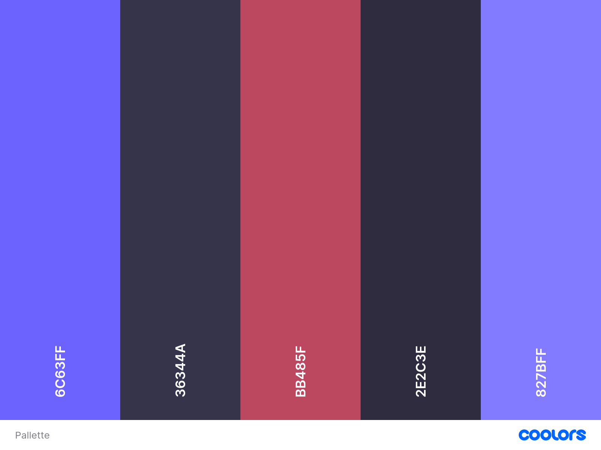

# Mental Health - One Page Website

## Project Overview

This is a streamlined, one-page website that prioritizes crisis intervention and immediate resource access. The design focuses on simplicity, speed, and accessibility to ensure people in mental health crises can quickly find the help they need.

## Key Features

- **Immediate Crisis Support**: Prominent crisis hotlines and emergency resources
- **Quick Resource Access**: Essential mental health information in digestible sections
- **Professional Help Finder**: Direct links to therapist directories and local services
- **Mobile-Optimized**: Fast-loading, responsive design for all devices
- **Accessibility-First**: WCAG 2.1 AA compliant for users with diverse needs

## Target Users

- People experiencing mental health crises
- Individuals seeking basic mental health information
- Friends and family looking to support someone
- Anyone needing quick access to mental health resources

## User Stories

See [`USER_STORIES.md`](./USER_STORIES.md) for detailed user stories covering:

- **Crisis Support** : Immediate help and emergency resources
- **Information & Resources**: Basic mental health information and guidance
- **Accessibility** : Mobile and inclusive design
- **Contact & Support** : Multiple ways to connect with help
-
## Page Structure

1. **Header**: Crisis hotlines and emergency button
2. **Immediate Help**: Crisis resources and contacts
3. **Understanding Mental Health**: Brief condition overview
4. **Find Professional Help**: Therapist and service directories
5. **Self-Help Resources**: Basic coping strategies
6. **Supporting Others**: Tips for friends and family
7. **Footer**: Additional resources and disclaimers

## Design Criteria

## WireFrame

## Pallette

#cdb4db #ffc8dd #ffafcc #bde0fe #a2d2ff
## Success Criteria

- Crisis resources accessible within 5 seconds
- Page loads in under 3 seconds
- 95%+ mobile usability score
- WCAG 2.1 AA accessibility compliance
- Positive user feedback on clarity and helpfulness

## External Resources

https://fontawesome.com/
https://fonts.google.com/
https://www.mentalhealth.org.uk/explore-mental-health/get-help
https://www.nhs.uk/nhs-services/mental-health-services/
https://www.mind.org.uk/
